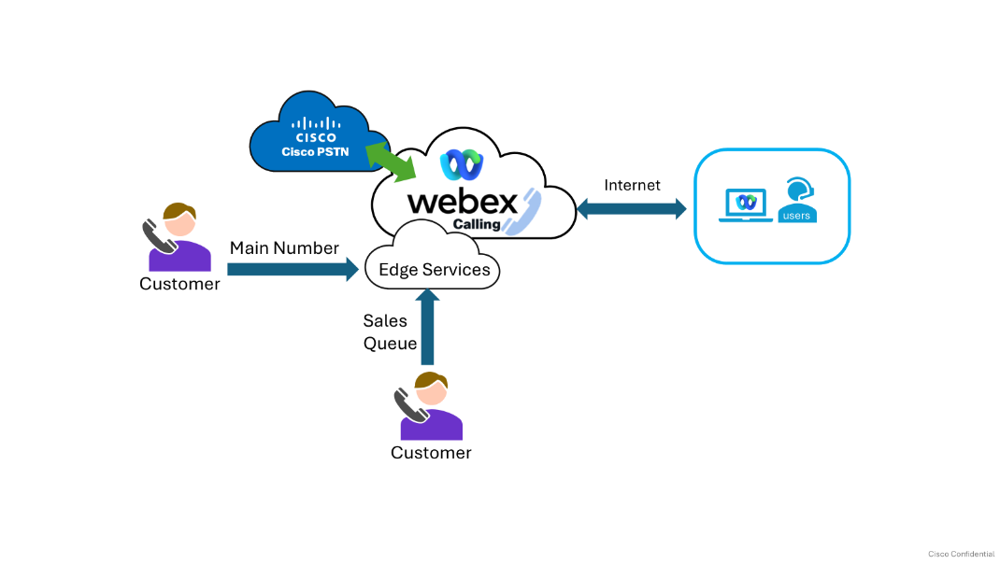
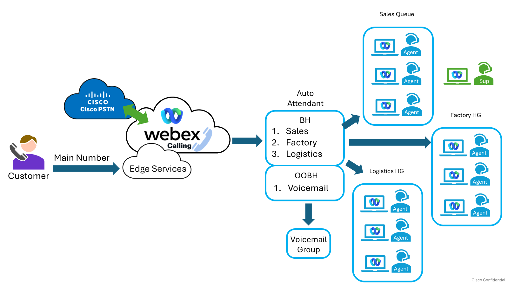

# Example Customer Scenario

VitaCrunch Foods needs a calling solution without additional equipment that remains flexible if employees need to work from home.

## Basic Customer Information

- **Customer:** VitaCrunch Foods
- **Location:** San Jose, California
- **Business vertical:** Manufacturer
- **About:** VitaCrunch Foods creates fun, flavorful snacks with wholesome ingredients. Its vibrant flavors and satisfying crunch make healthier snacking easy and enjoyable for busy people and families.

## Connectivity Requirements

{ width=75% }

## Users

| Department | Agents | Supervisors | Total |
| --- | ---: | ---: | ---: |
| Sales | 3 | 1 |  |
| Factory | 3 |  |  |
| Logistics | 2 |  |  |
| Totals | 8 | 1 | 8 |

## Call Flows

{ width=75% }

The guide notes that agents receive calls based on skills, supervisors monitor calls, and calls are recorded.
